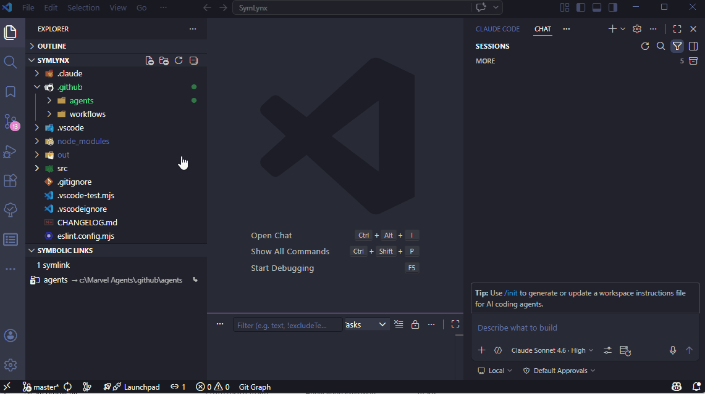
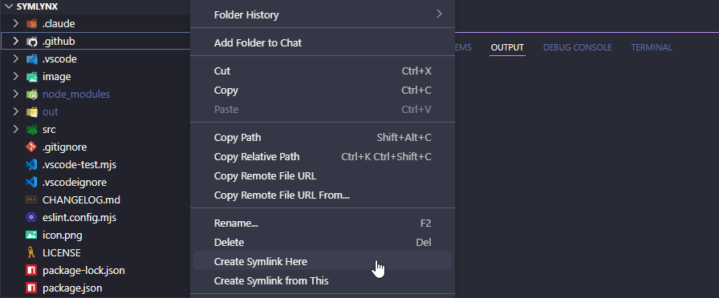
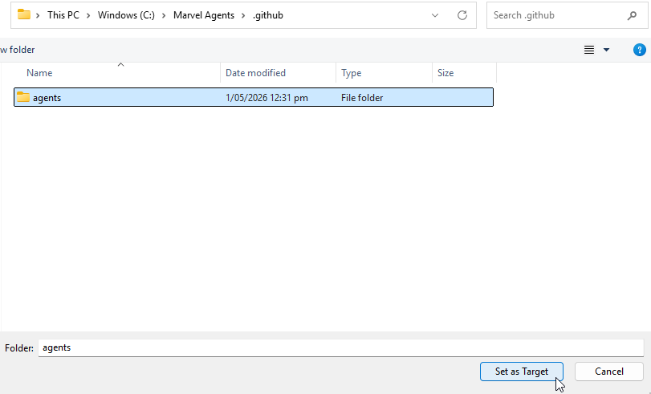
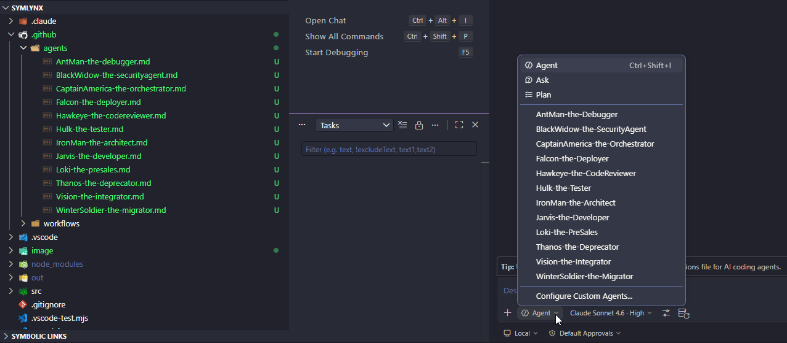

# SymLynx

Create, manage, and navigate symbolic links without ever leaving VS Code — at the speed of a Lynx.

[](https://marketplace.visualstudio.com/items?itemName=TeddyHerryanto.symlynx)

---

## Use Cases

### Centralise your AI agent configuration



AI agents read instruction files (`AGENTS.md`, etc.) from your project. Keeping a separate copy in every repo means they drift out of sync the moment you update one.

With SymLynx you can maintain a **single source of truth**:

1. Store your agent files in a dedicated folder, e.g. `~/ai-agents/`
2. For each project repo, right-click in Explorer → **Create Symlink Here** → point it at the folder in `~/ai-agents/`
3. Every project now shares the live folder — edit once, all repos pick it up instantly.

```
~/ai-agents/         ← one folder to rule them all
  Coder.md
  Code-Reviewer.md

~/projects/
  .github/agents
    Coder.md          →  ~/ai-agents/Coder.md   (symlink)
    Code-Reviewer.md  →  ~/ai-agents/Code-Reviewer.md   (symlink)
  repo-b/
    Coder.md          →  ~/ai-agents/Coder.md   (symlink)
    Code-Reviewer.md  →  ~/ai-agents/Code-Reviewer.md   (symlink)
  repo-c/
    Coder.md          →  ~/ai-agents/Coder.md   (symlink)
    Code-Reviewer.md  →  ~/ai-agents/Code-Reviewer.md   (symlink)
```

Use **Export / Import** to snapshot or replicate this link layout across machines.

---

## Features

### Symbolic Links panel
A dedicated panel in the Explorer sidebar lists every symlink and hard link found in your workspace. It updates automatically as files change.

- **Symlinks** — shown with a blue arrow icon (`→ target`)
- **Hard links** — shown with an orange link icon (`⇒ original`)
- **Broken symlinks** — shown with a yellow warning icon (`⚠ broken → target`)
- **Status bar badge** — bottom bar shows `🔗 5` (healthy) or `🔗 5  ⚠ 2` (broken links present). Click to jump to the panel.

### Create a symlink
Two ways, depending on which end you know first:

| Method | How |
|---|---|
| **Create Symlink Here** | Right-click a **folder** in Explorer → pick the target file or folder |
| **Create Symlink from This** | Right-click any **file or folder** → pick where to put the symlink |

Both methods ask for a name (defaulting to the target's filename) before creating.







### Hard links (Windows fallback)
If creating a file symlink fails on Windows due to missing Developer Mode, SymLynx offers to create a **hard link** instead — provided both files are on the same drive. Hard links require no elevated privileges and are tracked in the panel with an orange icon.

> **Hard link vs symlink:** A hard link is a second filename pointing to the exact same file data on disk. Deleting one name doesn't affect the other. Hard links work for files only, not folders, and cannot span drives.

### Fix a broken symlink
Right-click a broken symlink in the panel (or use the `$(wrench)` inline button) → pick a new target. The symlink is recreated at the same path pointing to the new target.

### Rename
Click the `$(edit)` inline button on any item, or right-click → **Rename…**. Renames in place — no delete and recreate needed.

### Delete
Click the `$(trash)` inline button or right-click → **Delete**. A confirmation prompt clarifies what will and won't be affected (targets are never touched).

### Reveal navigation
From any item in the panel:

| Action | Result |
|---|---|
| **Click item** | Reveals the symlink in VS Code's Explorer |
| **Reveal Target** | Opens the target file in the editor, or reveals a target folder |
| **Reveal Original** | (Hard links) Opens the original file in the editor |
| **Reveal Target in File Explorer** | Opens the target's location in Windows Explorer / Finder |

### Export & Import
Share your link setup across projects or team members.

**Export** (`$(cloud-upload)` button in panel title bar)
- Saves all links to a `.symlynx` JSON file
- Default filename: `<workspace-name>.symlynx`

**Import** (`$(cloud-download)` button in panel title bar)
1. Pick a `.symlynx` file
2. If importing into a different project and targets were inside the source workspace, SymLynx asks whether to remap those paths to the current workspace
3. A checklist lets you deselect individual links before committing
4. Items that would conflict or can't be created are flagged and pre-deselected

---

## Requirements

- **VS Code** `1.116.0` or later
- **Windows**: Directory symlinks are created as junctions (no elevation needed). File symlinks require [Developer Mode](ms-settings:developers) to be enabled, or administrator privileges. Hard links are offered as a fallback when both files are on the same drive.
- **macOS / Linux**: No special requirements.

---

## Usage

### Panel buttons (hover over "SYMBOLIC LINKS" header to reveal)

| Icon | Action |
|---|---|
| `$(cloud-download)` | Import links from a `.symlynx` file |
| `$(cloud-upload)` | Export all links to a `.symlynx` file |
| `$(refresh)` | Re-scan the workspace |

### Inline buttons (appear on hover in the panel)

| Icon | Symlink | Broken symlink | Hard link |
|---|---|---|---|
| `$(go-to-file)` | Reveal Target | — | Reveal Original |
| `$(wrench)` | — | Fix Broken Target | — |
| `$(edit)` | Rename | Rename | Rename |
| `$(trash)` | Delete | Delete | Delete |

### Command Palette

All commands are available via `Ctrl+Shift+P` (or `Cmd+Shift+P`) under the **SymLynx** category:

- `SymLynx: Create Symlink Here`
- `SymLynx: Create Symlink from This`
- `SymLynx: Fix Broken Target…`
- `SymLynx: Rename…`
- `SymLynx: Export Links…`
- `SymLynx: Import Links…`
- `SymLynx: Refresh`

---

## Known Issues

- File symlinks on Windows require Developer Mode. Use the hard link fallback for files on the same drive, or enable Developer Mode via `ms-settings:developers`.
- Hard links are tracked per-workspace in VS Code's workspace state. If you manually delete a hard link outside of SymLynx, its entry will remain in the panel until the next refresh (where it will show as broken).
